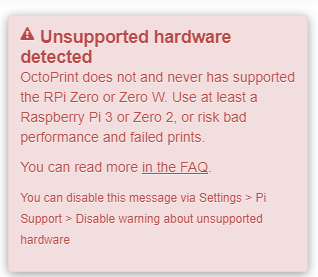
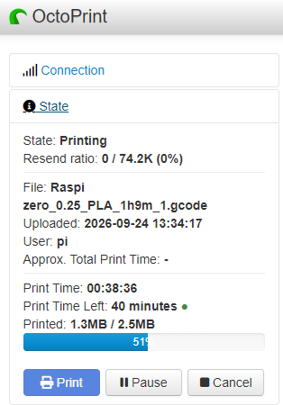
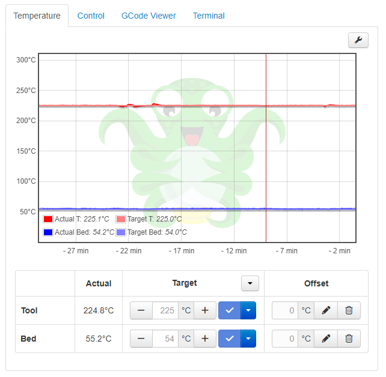
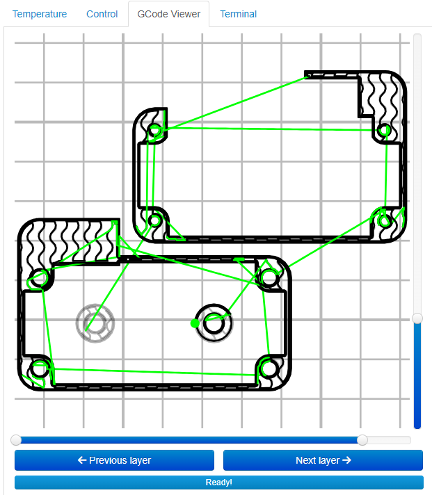

# OctoPrint on Raspberry Pi Zero W — Repeatable Setup Guide

Goal: network control of a 3D printer (e.g. Anycubic Vyper) — upload G-code, start prints, monitor progress — using OctoPrint on a Pi Zero W connected to the printer's mainboard via USB.

The Pi Zero W's older ARMv6 CPU is **not compatible with current OctoPi images out of the box**. This guide captures the working path found through trial and error, so it can be repeated without rediscovering each issue.




---

## Why
### Why to use OctoPi on Pi Zero W
- Good re-use for obsolete hardware.
- Loading the gcode and viewing the print progress from your computer.




### Why NOT to use OctoPi on Pi Zero W
- Officially not supported.
- Can't use the camera. It has too weak single core CPU to control the print process, web service and video stream.

---

## 0. Hardware notes

- Pi Zero W can be powered via GPIO header instead of micro-USB:
  - **+5V** → pin 2 and/or 4
  - **GND** → pin 6 (or any other GND pin)
  - No onboard protection on these pins (unlike micro-USB) — use a clean, fused 5V source and double-check polarity before connecting.
- To verify the board has power *before* inserting an SD card: measure ~3.3V between pin 1 (3.3V) and pin 6 (GND) with a multimeter. The green ACT LED does **not** reliably indicate power/boot state on the Zero W when no SD card is present — don't rely on it.
- Connect the Pi to the printer's mainboard via USB (Vyper: micro-USB or USB-B depending on board revision).

---

## 1. Flash the SD card

1. Download and install Raspberry Pi Imager from https://www.raspberrypi.com/software/
2. Open Raspberry Pi Imager, choose:
  - Device: Raspberry Pi Zero
  - OS -> Other specific purposes -> 3D printing -> OctoPi -> Stable
  - All the rest customization settings, set WiFi SSID/password and enable SSH.
3. Flash and boot.

**Known issue:** the WiFi credentials written by Imager are not always correctly picked up — see Step 2.

---

## 2. Fix WiFi if `octopi.local` doesn't resolve / IP shows as `127.0.0.1`

Get terminal access (HDMI + keyboard, or serial console) and check:

```bash
ifconfig wlan0                     # interface present but no inet = not associated
sudo iwlist wlan0 scan | grep -i ssid   # confirms Pi can see your SSID (must be 2.4GHz — Zero W has no 5GHz radio)
ls -la /etc/wpa_supplicant/        # check wpa_supplicant.conf exists / is symlinked from /boot
sudo rfkill list                   # check for "Soft blocked"
```

If `/etc/wpa_supplicant/wpa_supplicant.conf` is missing (the Imager's config never got applied), create it manually:

```bash
sudo nano /etc/wpa_supplicant/wpa_supplicant.conf
```

```
country=US
ctrl_interface=DIR=/var/run/wpa_supplicant GROUP=netdev
update_config=1

network={
 ssid="YourExactSSID"
 psk="YourExactPassword"
}
```

Bring it up and verify:

```bash
sudo wpa_supplicant -B -i wlan0 -c /etc/wpa_supplicant/wpa_supplicant.conf
sudo dhclient wlan0
ip a show wlan0                    # should now show a real inet address

sudo systemctl enable wpa_supplicant
sudo reboot
ip a show wlan0                    # confirm it comes up automatically after reboot
```

---

## 3. Fix OctoPrint crashing with `signal=ILL` (illegal instruction)

**Root cause:** current OctoPi images ship OctoPrint built against `pydantic_core`, a Rust-compiled binary assuming ARMv7+ instructions. The Pi Zero W's ARMv6 (BCM2835/ARM11) CPU doesn't have those instructions, so the process is killed instantly with `SIGILL` — before any log file is even created.

Confirm with:
```bash
sudo service octoprint status
# Look for: code=killed, signal=ILL
```
```bash
strace -f /home/pi/oprint/bin/octoprint serve --host=127.0.0.1 --port=5000 2>&1 | tail -50
# Crash will show the last library loaded before SIGILL, e.g. .../pydantic_core/_pydantic_core.cpython-311-arm-linux-gnueabihf.so
```

**Fix:** downgrade to OctoPrint 1.9.3, which predates the `pydantic` dependency, in a **fresh clean virtualenv** (patching the existing venv in place leads to a tangle of mismatched transitive dependencies — build fresh instead):

```bash
sudo service octoprint stop
python3 -m venv /home/pi/oprint_193
/home/pi/oprint_193/bin/pip install --upgrade pip
```

---

## 4. Fix the `Flask-Limiter` / `limits` rate-limiter crash

**Root cause:** OctoPrint 1.9.3's code hardcodes the rate-limiting strategy `"fixed-window-elastic-expiry"`. This strategy was **removed in `limits` version 5.0** (April 2025). Since OctoPrint's own dependency spec doesn't pin `limits` tightly, a plain `pip install OctoPrint==1.9.3` can pull the newest (incompatible) `limits`.

Symptom:
```
limits.errors.ConfigurationError: Invalid rate limiting strategy fixed-window-elastic-expiry
```

**Fix:** constrain `limits` **in the same install command** as OctoPrint, so pip resolves a fully consistent, compatible dependency set from the start (installing `OctoPrint` and `Flask-Limiter`/`limits` separately/sequentially causes pip to silently upgrade Flask to an incompatible 3.x version, breaking OctoPrint's own imports — e.g. `ImportError: cannot import name 'locked_cached_property' from 'flask.helpers'`, since that symbol was removed in Flask 2.3+):

```bash
/home/pi/oprint_193/bin/pip install "OctoPrint==1.9.3" "limits<5.0"
```

Sanity-check before wiring into systemd:

```bash
/home/pi/oprint_193/bin/pip check
/home/pi/oprint_193/bin/octoprint serve --host=127.0.0.1 --port=5000
# Run in foreground; Ctrl+C once it starts cleanly without crashing
```

(Note: `pip check` may still list some packages as "not supported on this platform" — e.g. `cffi`, `PyYAML`, `psutil`. These are generally just wheel-tag warnings on ARMv6 and not the cause of a crash, as long as OctoPrint actually starts and stays running.)

---

## 5. Point the systemd service at the new venv

```bash
sudo nano /etc/systemd/system/octoprint.service
```

Change the `ExecStart` line to:
```
ExecStart=/home/pi/oprint_193/bin/octoprint serve --host=${HOST} --port=${PORT}
```

Apply and verify:

```bash
sudo systemctl daemon-reload
sudo service octoprint restart
sudo service octoprint status      # should show: active (running), no crash
```

---

## 6. Ongoing use

- Slice G-code normally in your usual slicer (Cura, PrusaSlicer, ANYCUBIC Slicer Next, etc.) — OctoPrint does not slice.
- Upload the sliced `.gcode` to OctoPrint via the web UI (`http://octopi.local`) or a slicer plugin (Cura's OctoPrint Connection plugin, PrusaSlicer's built-in Physical Printer upload).
  - N.B.! It is possible to upload the gcode file to SD card of the printer. However, over 115200 baud connection to the printer it takes forever. Therefore, it is recommended to upload the gcode to Octipi storage: save time, you live once.
- Start/pause/cancel prints and monitor temperatures/progress from the OctoPrint web UI.


- **Do not let OctoPrint's built-in updater upgrade past 1.9.3** without checking whether newer versions reintroduce the `pydantic` dependency — this is what caused the original crash. Disable auto-update checks or review the changelog before any manual update.
- Optional: put the Raspberry Pi Zero into a nice case. Example:


---

## Known-good version pins (for reference)

| Package | Version |
|---|---|
| OctoPrint | 1.9.3 |
| limits | < 5.0 |
| Python venv | fresh, no `--system-site-packages` |
